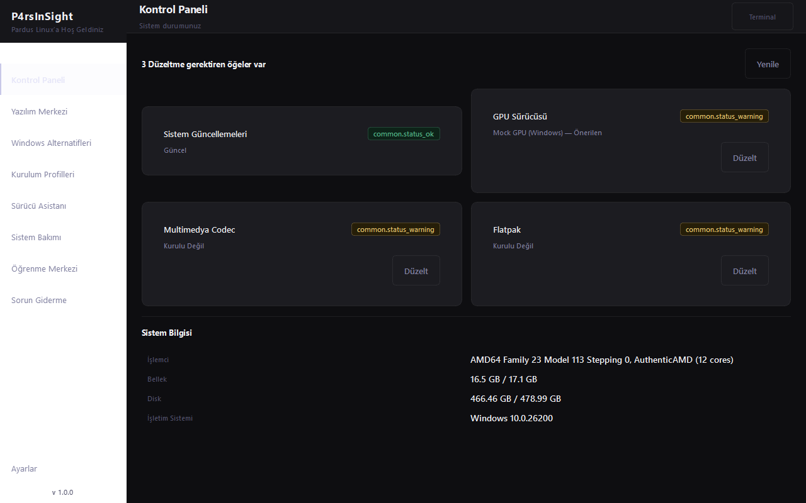
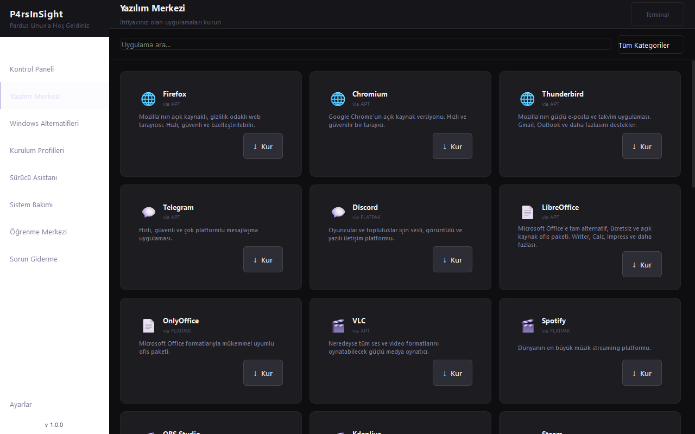
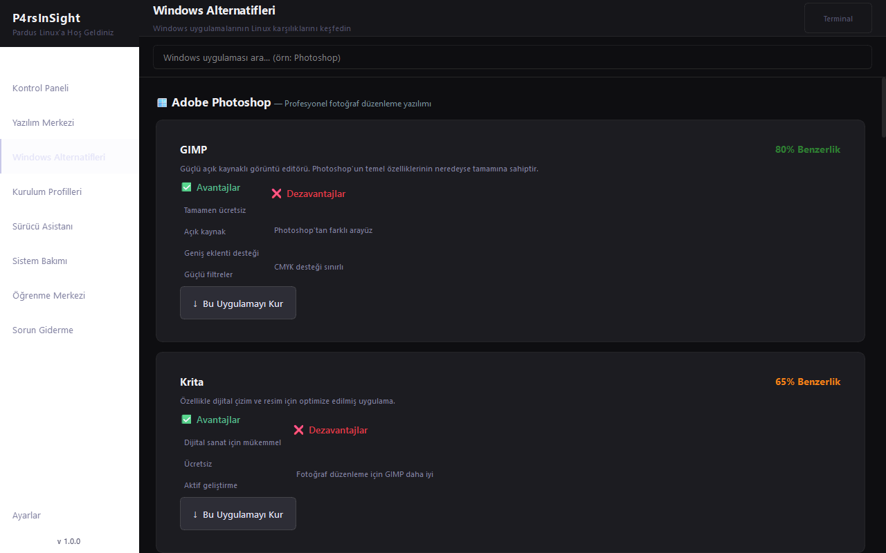
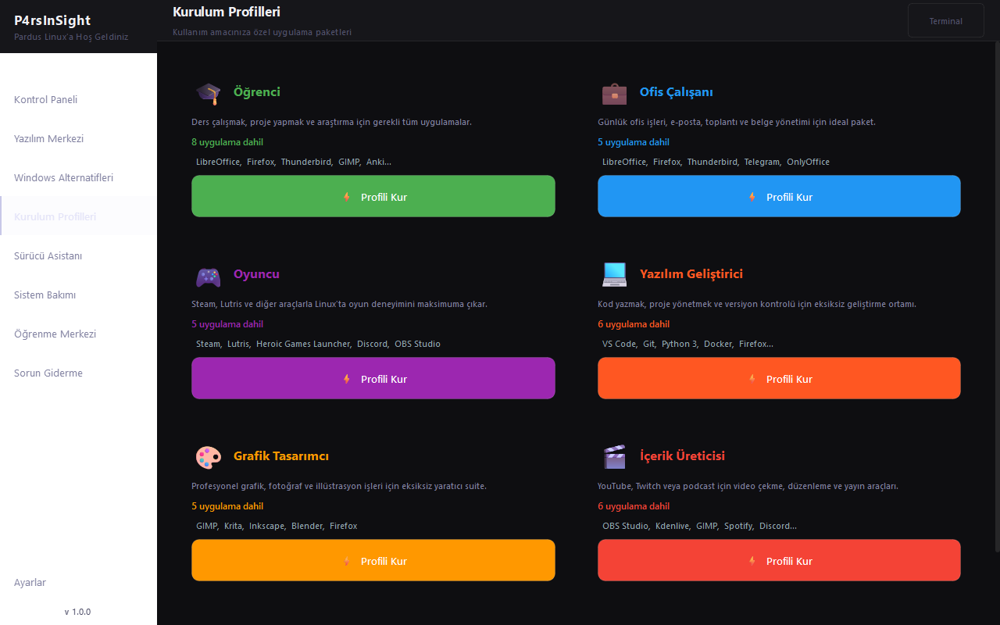
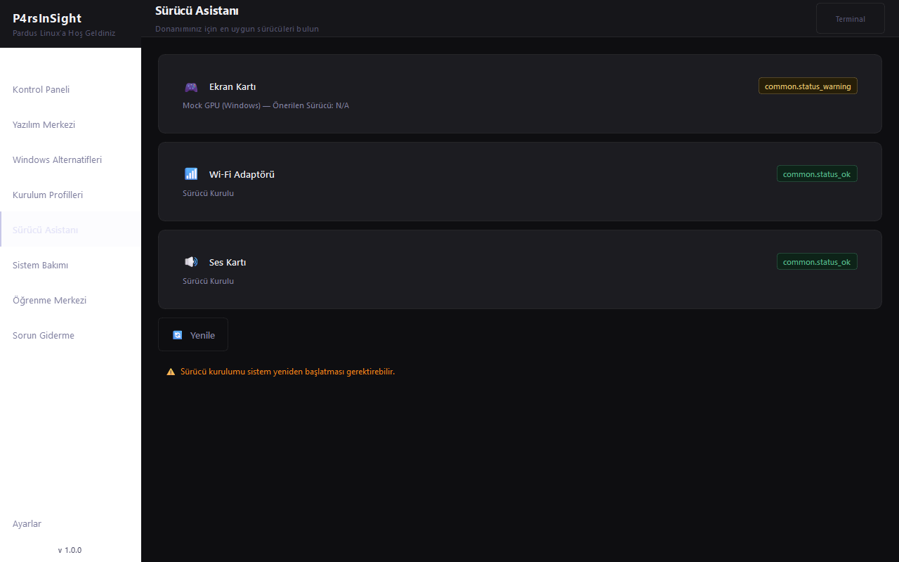
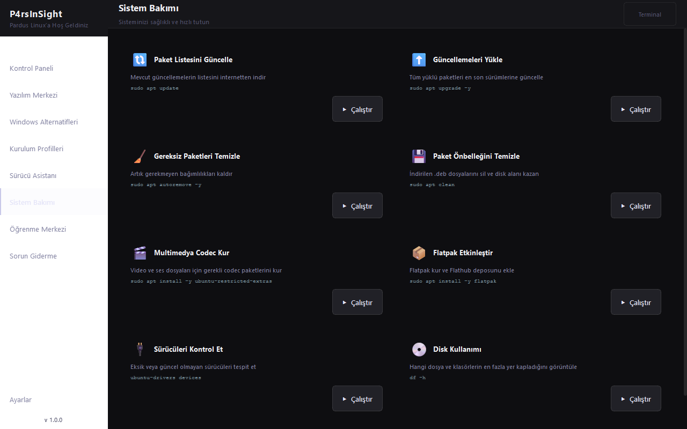
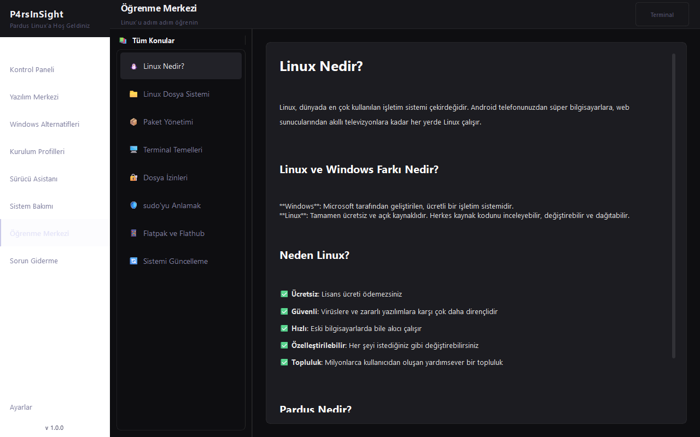
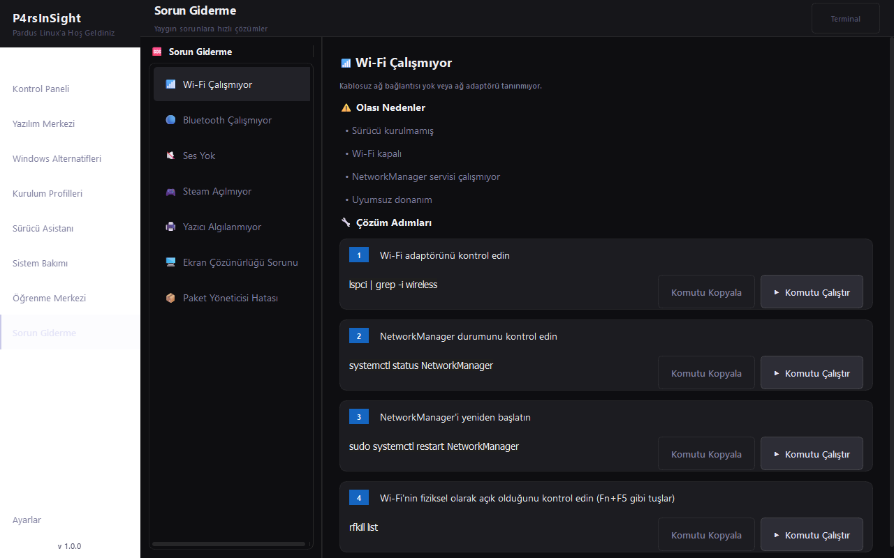
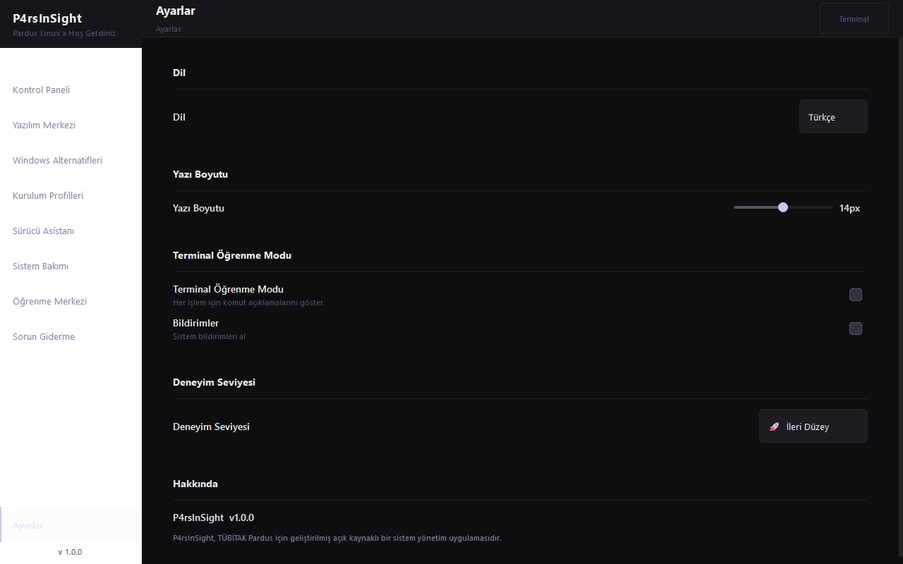

# P4rsInSight 🐧

**P4rsInSight** — Pardus Linux için akıllı başlangıç, paket yükleme, sistem bakım ve sorun giderme kılavuzunu barındıran entegre yönetim uygulaması. 

*An intelligent onboarding and system management application for Pardus Linux.*

---

## 🚀 Kurulum / Installation

### Gereksinimler / Requirements
- **Python**: 3.10+
- **PySide6**: 6.6+
- **psutil**: 5.9.0+

### Kurulum Adımları / Setup Steps

```bash
# 1. Bağımlılıkları kur / Install dependencies
pip install -r requirements.txt

# 2. Uygulamayı başlat / Run the application
python main.py
```

### 🛠️ Tek Başına Çalıştırılabilir Dosya Oluşturma / Building Standalone Executable
Uygulamayı tek bir çalıştırılabilir dosya (Windows'ta `.exe`, Linux'ta binary) haline getirmek için **PyInstaller** kullanılır. Proje dizininde yer alan `ParsInSight.spec` dosyası tüm derleme yapılandırmasını içerir.

1. **PyInstaller'ı kurun / Install PyInstaller:**
   ```bash
   pip install pyinstaller
   ```

2. **Derleme işlemini başlatın / Start the build process:**
   ```bash
   # ParsInSight dizinine geçin
   cd ParsInSight
   
   # PyInstaller'ı spec dosyası ile çalıştırın
   pyinstaller ParsInSight.spec
   ```

3. **Derleme çıktıları / Build outputs:**
   * **`dist/`**: Derlenmiş tek başına çalışan executable dosyayı (`ParsInSight` veya `ParsInSight.exe`) içerir.
   * **`build/`**: Derleme sırasında kullanılan geçici nesneleri ve logları içerir.

---

## 📸 Ekran Görüntüleri / Screenshots

<details>
<summary>🏠 Kontrol Paneli / Dashboard (Genişlet / Expand)</summary>
<p align="center">
  
</p>
</details>

<details>
<summary>📦 Yazılım Merkezi / Software Center (Genişlet / Expand)</summary>
<p align="center">
  
</p>
</details>

<details>
<summary>🪟 Windows Alternatifleri / Windows Alternatives (Genişlet / Expand)</summary>
<p align="center">
  
</p>
</details>

<details>
<summary>👤 Kurulum Profilleri / Profiles (Genişlet / Expand)</summary>
<p align="center">
  
</p>
</details>

<details>
<summary>🔌 Sürücü Asistanı / Driver Assistant (Genişlet / Expand)</summary>
<p align="center">
  
</p>
</details>

<details>
<summary>🛠️ Sistem Bakımı / Maintenance (Genişlet / Expand)</summary>
<p align="center">
  
</p>
</details>

<details>
<summary>📚 Öğrenme Merkezi / Learning Center (Genişlet / Expand)</summary>
<p align="center">
  
</p>
</details>

<details>
<summary>🆘 Sorun Giderme / Troubleshooting (Genişlet / Expand)</summary>
<p align="center">
  
</p>
</details>

<details>
<summary>⚙️ Ayarlar / Settings (Genişlet / Expand)</summary>
<p align="center">
  
</p>
</details>

---

## 🗺️ Yol Haritası / Roadmap

- [x] **v1.0.0 — Temel Sürüm (Mevcut)**
  - PySide6 tabanlı modern arayüz ve koyu tema
  - Yazılım Merkezi (Flatpak + APT) ve Windows Alternatifleri
  - Donanım tespiti ve Sürücü Asistanı
  - Sistem Bakımı, Öğrenme Merkezi ve Sorun Giderme
  - Çoklu dil desteği (7 Dil)
- [ ] **v1.1.0 — Arayüz & Deneyim İyileştirmeleri**
  - [ ] Açık Tema (Light Theme) desteğinin modern bir tasarım diliyle sıfırdan yazılması
  - [ ] Sayfalar arası geçiş animasyonlarının optimize edilmesi
  - [ ] Masaüstü bildirim sistemi entegrasyonu
- [ ] **v1.2.0 — Paket Yönetimi Genişletmesi**
  - [ ] Snap paket desteği ve daha geniş yazılım kataloğu (50+ Uygulama)
  - [ ] Kullanıcı tanımlı özel kurulum profilleri (Custom Profiles) oluşturma yeteneği
- [ ] **v1.3.0 — İzleme & Güvenlik**
  - [ ] Canlı CPU/RAM/Ağ tüketim grafikleri
  - [ ] Pardus UFW (Güvenlik Duvarı) kolay yönetim arayüzü
  - [ ] Sistem yedekleme asistanı entegrasyonu (Timeshift/Rsync)

---

## 📖 Uygulama Modülleri ve Detaylı İçerik

### 1. Hoş Geldin Sihirbazı (Welcome Wizard)
Uygulama ilk kez çalıştırıldığında kullanıcıları karşılayan 3 adımlı yapılandırma aracıdır:
*   **1. Adım (Dil Seçimi):** Türkçe, İngilizce, Almanca, Fransızca, İspanyolca, İtalyanca ve Arapça dil seçeneklerinden birini belirler.
*   **2. Adım (Tema Seçimi):** Koyu Tema veya Açık Tema seçeneği sunar.
*   **3. Adım (Deneyim Seviyesi):** 
    *   *Yeni Başlayan:* Linux komutlarına aşina olmayanlar için Terminal Öğrenme Modu'nu otomatik açar.
    *   *Orta Düzey:* Temel komutları bilen kullanıcılara yöneliktir.
    *   *İleri Düzey:* Deneyimli kullanıcılar için yönetici araçlarını etkinleştirir.

---

### 2. Kontrol Paneli (Dashboard)
Sistemin genel durumunu anlık olarak analiz eden ve sistem sağlığını görselleştiren paneldir:
*   **Sistem Bilgileri:**
    *   **İşlemci (CPU):** Kullanım yüzdesi ve model bilgisi.
    *   **Bellek (RAM):** Toplam ve boş RAM miktarı, yüzde gösterimi.
    *   **Disk:** Disk doluluk oranı ve kalan alan.
    *   **İşletim Sistemi (OS):** Dağıtım adı ve kernel sürümü.
*   **Tek Tıkla Hızlı Düzeltmeler:**
    *   *Sistem Güncellemeleri:* Eksik paket güncellemelerini algılar.
    *   *GPU Sürücüsü:* Ekran kartı sürücülerinin durumunu gösterir.
    *   *Multimedya Codec:* Eksik ses/video çözücülerini kurmayı önerir.
    *   *Flatpak Entegrasyonu:* Flatpak altyapısının kurulu olup olmadığını kontrol eder.
    *   *Yazıcı Sürücüsü:* CUPS yazıcı sisteminin kurulu olmasını sağlar.

---

### 3. Yazılım Merkezi (Software Center)
Paket yönetim altyapısını kullanarak 27 popüler uygulamayı tek bir tıkla APT veya Flatpak üzerinden kurmanızı ve kaldırmanızı sağlar:

| Uygulama Adı | Kategori | Açıklama | Yükleme Yöntemi | Paket/Flatpak ID |
|---|---|---|---|---|
| **Firefox** | İnternet | Mozilla'nın açık kaynaklı, gizlilik odaklı web tarayıcısı. | APT | `firefox` |
| **Chromium** | İnternet | Google Chrome'un açık kaynak versiyonu. | APT | `chromium` |
| **Thunderbird** | İnternet | Mozilla'nın güçlü e-posta ve takvim uygulaması. | APT | `thunderbird` |
| **Telegram** | İletişim | Hızlı, güvenli ve çok platformlu mesajlaşma uygulaması. | APT | `telegram-desktop` |
| **Discord** | İletişim | Oyuncular ve topluluklar için sesli, görüntülü ve yazılı iletişim platformu. | Flatpak | `com.discordapp.Discord` |
| **LibreOffice** | Ofis | Microsoft Office'e tam alternatif, ücretsiz ve açık kaynak ofis paketi. | APT | `libreoffice` |
| **OnlyOffice** | Ofis | Microsoft Office formatlarıyla mükemmel uyumlu ofis paketi. | Flatpak | `org.onlyoffice.desktopeditors` |
| **GnuCash** | Ofis | Kişisel ve küçük işletme muhasebe yazılımı. | APT | `gnucash` |
| **VLC** | Multimedya | Neredeyse tüm ses ve video formatlarını oynatabilecek güçlü medya oynatıcı. | APT | `vlc` |
| **Spotify** | Multimedya | Dünyanın en büyük müzik streaming platformu. | Flatpak | `com.spotify.Client` |
| **OBS Studio** | Multimedya | Profesyonel ekran kaydı ve canlı yayın yazılımı. | APT | `obs-studio` |
| **Kdenlive** | Multimedya | Güçlü ve ücretsiz video düzenleme yazılımı. | APT | `kdenlive` |
| **Steam** | Oyun | Dünyanın en büyük oyun platformu. | APT | `steam` |
| **Lutris** | Oyun | Linux oyun yöneticisi. Windows oyunlarını Wine üzerinden çalıştırmanıza yardımcı olur. | APT | `lutris` |
| **Heroic Games Launcher** | Oyun | Epic Games ve GOG oyunlarını Linux'ta oynamanızı sağlayan açık kaynak başlatıcı. | Flatpak | `com.heroicgameslauncher.hgl` |
| **VS Code** | Geliştirme | Microsoft'un açık kaynaklı, son derece popüler kod editörü. | Flatpak | `com.visualstudio.code` |
| **Git** | Geliştirme | Dünyanın en yaygın kullanılan dağıtık versiyon kontrol sistemi. | APT | `git` |
| **Python 3** | Geliştirme | Öğrenmesi kolay, güçlü ve çok yönlü programlama dili. | APT | `python3 python3-pip` |
| **Docker** | Geliştirme | Uygulama konteyner platformu. Geliştiriciler için vazgeçilmez araç. | APT | `docker.io` |
| **GIMP** | Grafik | Güçlü açık kaynaklı görüntü düzenleme yazılımı. Photoshop alternatifi. | APT | `gimp` |
| **Krita** | Grafik | Dijital sanatçılar için profesyonel açık kaynak çizim uygulaması. | APT | `krita` |
| **Inkscape** | Grafik | Profesyonel vektör grafik editörü. Illustrator alternatifi. | APT | `inkscape` |
| **Blender** | Grafik | Dünya standartlarında 3D modelleme, animasyon ve render yazılımı. | APT | `blender` |
| **GParted** | Araçlar | Disk bölümleme aracı. Sabit disk bölümlerini yönetmek için kullanılır. | APT | `gparted` |
| **Timeshift** | Araçlar | Sistem geri yükleme aracı. Sistem anlık görüntüleri alır. | APT | `timeshift` |
| **GeoGebra** | Eğitim | Matematik ve geometri için interaktif yazılım. | Flatpak | `org.geogebra.GeoGebra` |
| **Anki** | Eğitim | Aralıklı tekrar sistemiyle kelime ve bilgi ezberlemek için flash kart uygulaması. | APT | `anki` |

---

### 4. Windows Alternatifleri (Windows Alternatives)
Windows'tan Linux'a geçen kullanıcılar için en çok ihtiyaç duyulan 11 programın Linux dünyasındaki karşılıklarını, benzerlik oranlarını ve detaylı artı/eksi yönlerini listeler:

*   **Adobe Photoshop** → 
    *   **GIMP** *(Benzerlik: %80 - APT)*: 
        *   *Artıları:* Tamamen ücretsiz, açık kaynak, geniş eklenti desteği, güçlü filtreler.
        *   *Eksileri:* Photoshop'tan farklı arayüz, CMYK desteği sınırlı.
    *   **Krita** *(Benzerlik: %65 - APT)*:
        *   *Artıları:* Dijital sanat ve çizim için mükemmel, ücretsiz, aktif geliştiriliyor.
        *   *Eksileri:* Fotoğraf düzenleme özellikleri GIMP kadar gelişmiş değil.
*   **Microsoft Word** →
    *   **LibreOffice Writer** *(Benzerlik: %90 - APT)*:
        *   *Artıları:* Tamamen ücretsiz, `.docx` formatına tam destek, hızlı, güçlü şablon sistemi.
        *   *Eksileri:* Bazı çok karmaşık Word makroları çalışmayabilir.
    *   **OnlyOffice** *(Benzerlik: %88 - Flatpak)*:
        *   *Artıları:* MS Word arayüzüne neredeyse birebir benzerlik, mükemmel `.docx` uyumluluğu.
        *   *Eksileri:* Bazı çok gelişmiş özellikler eksik.
*   **Microsoft Excel** →
    *   **LibreOffice Calc** *(Benzerlik: %85 - APT)*:
        *   *Artıları:* Ücretsiz, `.xlsx` desteği, makro desteği, pivot tablo oluşturma.
        *   *Eksileri:* Karmaşık Excel makrolarında uyumluluk sorunları olabilir.
*   **Microsoft PowerPoint** →
    *   **LibreOffice Impress** *(Benzerlik: %82 - APT)*:
        *   *Artıları:* Ücretsiz, `.pptx` desteği, geçiş ve animasyon desteği.
        *   *Eksileri:* Bazı karmaşık animasyonlar farklı görünebilir.
*   **Adobe Premiere Pro** →
    *   **Kdenlive** *(Benzerlik: %75 - APT)*:
        *   *Artıları:* Ücretsiz, çoklu parça (multi-track) desteği, zengin geçiş ve efekt arşivi, GPU hızlandırma.
        *   *Eksileri:* Premiere Pro'dan farklı iş akışı.
    *   **DaVinci Resolve** *(Benzerlik: %85 - Manuel Kurulum)*:
        *   *Artıları:* Sinema kalitesinde renk derecelendirme, profesyonel video kurgu araçları, güçlü ücretsiz sürüm.
        *   *Eksileri:* Çok yüksek sistem gereksinimi, kurulumu daha karmaşıktır.
*   **Adobe Illustrator** →
    *   **Inkscape** *(Benzerlik: %78 - APT)*:
        *   *Artıları:* Tamamen ücretsiz, yerleşik SVG format desteği, zengin eklenti kütüphanesi.
        *   *Eksileri:* Illustrator'ın bazı ileri düzey ticari araçları eksik.
*   **Notepad++** →
    *   **VS Code** *(Benzerlik: %80 - Flatpak)*:
        *   *Artıları:* Binlerce eklenti desteği, güçlü git entegrasyonu, yerleşik hata ayıklama (debug).
        *   *Eksileri:* Notepad++'a göre daha fazla RAM ve kaynak kullanır.
    *   **Kate** *(Benzerlik: %85 - APT)*:
        *   *Artıları:* Çok hafif ve hızlı, güçlü söz dizimi vurgulaması (syntax highlighting).
        *   *Eksileri:* VS Code kadar geniş bir eklenti mağazası bulunmuyor.
*   **WinRAR** →
    *   **Ark** *(Benzerlik: %90 - APT)*:
        *   *Artıları:* Ücretsiz, RAR, ZIP, TAR vb. geniş format desteği, sade arayüz.
        *   *Eksileri:* RAR formatında sıkıştırma (arşivleme) için sistemde ek paket kurulu olmalıdır.
*   **Paint** →
    *   **KolourPaint** *(Benzerlik: %95 - APT)*:
        *   *Artıları:* MS Paint arayüzünün neredeyse birebir kopyasıdır, hafif ve öğrenmesi çok kolaydır.
        *   *Eksileri:* Sadece en temel çizim özelliklerini destekler.
*   **Visual Studio** →
    *   **VS Code** *(Benzerlik: %75 - Flatpak)*:
        *   *Artıları:* Hafif, hızlı, zengin uzantı desteğiyle tam bir IDE'ye dönüştürülebilir.
        *   *Eksileri:* Visual Studio kadar tek pakette entegre gelmez, ayarları özelleştirmek gerekir.
*   **Spotify** →
    *   **Spotify (Linux)** *(Benzerlik: %98 - Flatpak)*:
        *   *Artıları:* Spotify'ın resmi Linux istemcisidir, Windows sürümüyle aynı özelliklere sahiptir.
        *   *Eksileri:* Flatpak üzerinden kurulum gerektirir.

---

### 5. Kurulum Profilleri (Profiles)
Tek tek uygulama kurmak yerine, bilgisayarınızı kullanım amacınıza göre hazırlamak için 6 adet önceden yapılandırılmış toplu kurulum paketi sunar:
1.  **🎓 Öğrenci (Student):** Ders çalışmak, ödev hazırlamak ve araştırma yapmak için.
    *   *İçerik:* LibreOffice, Firefox, Thunderbird, GIMP, Anki, GeoGebra, Git, Python 3.
2.  **💼 Ofis Çalışanı (Office Worker):** Günlük ofis işleri, takvim, toplantılar ve döküman yönetimi için.
    *   *İçerik:* LibreOffice, Firefox, Thunderbird, Telegram, OnlyOffice.
3.  **🎮 Oyuncu (Gamer):** Steam oyunları ve Linux uyumluluk katmanlarını kurmak için.
    *   *İçerik:* Steam, Lutris, Heroic Games Launcher, Discord, OBS Studio.
4.  **💻 Yazılım Geliştirici (Software Developer):** Geliştirme ortamı, Git ve konteyner teknolojileri için.
    *   *İçerik:* VS Code, Git, Python 3, Docker, Firefox, Thunderbird.
5.  **🎨 Grafik Tasarımcı (Graphic Designer):** Görsel tasarım, vektörel çizim ve 3D modelleme için.
    *   *İçerik:* GIMP, Krita, Inkscape, Blender, Firefox.
6.  **🎬 İçerik Üreticisi (Content Creator):** Yayıncılık, video düzenleme ve ses araçları için.
    *   *İçerik:* OBS Studio, Kdenlive, GIMP, Spotify, Discord, Firefox.

---

### 6. Sistem Bakımı (Maintenance)
Pardus sisteminizi temiz, güvenli ve performanslı tutmak için çalıştırabileceğiniz 8 temel sistem bakım aracıdır. Komutların ne işe yaradığı çalıştırılmadan önce Terminal Panelinde açıklanır:
1.  **Paket Listesini Güncelle:** `sudo apt update`
    *   *Mevcut güncellemelerin güncel listelerini sunuculardan indirir.*
2.  **Güncellemeleri Yükle:** `sudo apt upgrade -y`
    *   *Tüm kurulu programları ve sistem dosyalarını en yeni sürümlerine yükseltir.*
3.  **Gereksiz Paketleri Temizle:** `sudo apt autoremove -y`
    *   *Eski programlardan geriye kalan, artık kullanılmayan sistem bağımlılıklarını kaldırır.*
4.  **Paket Önbelleğini Temizle:** `sudo apt clean`
    *   *İndirilmiş ve kurulmuş `.deb` uzantılı arşiv dosyalarını silerek diskte yer açar.*
5.  **Multimedya Codec Kur:** `sudo apt install -y ubuntu-restricted-extras`
    *   *MP4, MP3 gibi patentli video ve ses dosyalarını oynatmak için gerekli çözücüleri kurar.*
6.  **Flatpak Etkinleştir:** `sudo apt install -y flatpak`
    *   *Flatpak paket yöneticisi motorunu kurarak Flathub deposunu sisteme ekler.*
7.  **Sürücüleri Kontrol Et:** `ubuntu-drivers devices`
    *   *Eksik ve kurulması önerilen donanım sürücülerinin listesini döner.*
8.  **Disk Kullanımı:** `df -h`
    *   *Sistemdeki disk bölümlerini ve doluluk oranlarını okunabilir formatta gösterir.*

---

### 7. Sürücü Asistanı (Driver Assistant)
Bilgisayarın donanımını (PCI ve USB veri yollarını) tarayarak uygun sürücüleri tespit eder ve kurulumunu kolaylaştırır:
*   **Ekran Kartı (GPU):** Nvidia, AMD veya Intel ekran kartlarını tespit edip gerekli sahipli veya açık kaynak sürücüleri önerir.
*   **Kablosuz Ağ (Wi-Fi):** Broadcom, Realtek gibi özel sürücü gerektiren Wi-Fi adaptörlerini tespit eder.
*   **Yazıcı (Printer):** CUPS yazıcı yönetim sisteminin durumunu kontrol eder ve yerel/ağ yazıcıları için gerekli paketleri kurar.
*   **Ses Kartı:** Ses arabirimi sürücülerini kontrol eder.

---

### 8. Öğrenme Merkezi (Learning Center)
Linux dünyasına yeni adım atan kullanıcıların kendilerini geliştirebilmeleri için zengin ve eğitici 8 farklı ders içerir:
*   **Linux Nedir?:** Linux çekirdeğinin yapısı, Windows ile farkları ve Pardus işletim sisteminin Debian tabanlı mimarisi.
*   **Linux Dosya Sistemi:** Linux'ta `C:` veya `D:` gibi sürücüler yerine `/` (kök dizin) yapısının kullanımı, `/home`, `/etc`, `/bin`, `/var` gibi kritik klasörlerin işlevleri ve gizli dosyalar.
*   **Paket Yönetimi:** Paket yöneticisi kavramı, `APT` sistemi ve `sudo apt update`, `upgrade`, `install`, `remove` komutlarının kullanımı, Flatpak teknolojisi.
*   **Terminal Temelleri:** Terminalin işleyişi ve en sık kullanılan temel komutlar (`ls`, `cd`, `pwd`, `mkdir`, `rm`, `cp`, `mv`, `clear`), Tab tuşu ile tamamlama.
*   **Dosya İzinleri:** Okuma (r), yazma (w) ve çalıştırma (x) izinlerinin anlamı. Sahip, Grup ve Diğerleri için izin yapısının `chmod` ile yönetimi.
*   **`sudo`'yu Anlamak:** `sudo` komutunun ne olduğu, yönetici (root) yetkileri ve terminal şifre yazma sırasındaki güvenlik önlemleri.
*   **Flatpak ve Flathub:** Flatpak'in yalıtılmış çalışma prensibi (sandbox), Flathub deposunu sisteme ekleme ve `flatpak install` kullanımı.
*   **Sistemi Güncelleme:** Güvenlik ve stabilite için sistem güncellemenin önemi ve `unattended-upgrades` ile otomatik güncelleme ayarları.

---

### 9. Sorun Giderme (Troubleshooting)
Sıkça karşılaşılan sorunları analiz ederek kullanıcılara adım adım çözüm sunan interaktif sorun gidericidir:
1.  **📶 Wi-Fi Çalışmıyor:** 
    *   *Nedenleri:* Sürücünün kurulmaması, Wi-Fi adaptörünün donanımsal olarak kapalı olması veya NetworkManager servisinin çalışmaması.
    *   *Çözüm Adımları:* `lspci` ile tarama → `systemctl status NetworkManager` ile kontrol → `sudo systemctl restart NetworkManager` ile servis sıfırlama → `rfkill list` ile engelleri kontrol etme.
2.  **🔵 Bluetooth Çalışmıyor:**
    *   *Nedenleri:* Bluetooth servisinin durması veya sürücü sorunları.
    *   *Çözüm Adımları:* `systemctl status bluetooth` → `sudo systemctl start bluetooth` → `sudo apt install bluetooth bluez blueman` ile gerekli yazılım paketlerini kurma.
3.  **🔇 Ses Yok:**
    *   *Nedenleri:* PulseAudio/PipeWire sorunları, çıkış cihazının sessizde olması veya sürücü hataları.
    *   *Çözüm Adımları:* `aplay -l` ile cihazları listeleme → `pulseaudio --kill && pulseaudio --start` ile ses sunucusunu sıfırlama → `sudo apt install pavucontrol` ile ses panelini kurma.
4.  **🎮 Steam Açılmıyor:**
    *   *Nedenleri:* 32-bit kütüphanelerin sistemde etkinleştirilmemiş olması, bağımlılıkların eksik olması.
    *   *Çözüm Adımları:* `sudo dpkg --add-architecture i386` ile 32-bit desteği ekleme → `sudo apt update` → `sudo apt install --reinstall steam` ile yeniden kurulum.
5.  **🖨️ Yazıcı Algılanmıyor:**
    *   *Nedenleri:* CUPS yazdırma servisinin kurulu olmaması veya izin yetersizliği.
    *   *Çözüm Adımları:* `sudo apt install cups cups-bsd` → `sudo systemctl start cups` → `xdg-open http://localhost:631` ile yerel CUPS arayüzünü açıp tanımlama.
6.  **🖥️ Ekran Çözünürlüğü Sorunu:**
    *   *Nedenleri:* GPU grafik sürücülerinin kurulu olmaması veya EDID ekran okuma hatası.
    *   *Çözüm Adımları:* `xrandr` ile mevcut çözünürlükleri listeleme → `lspci | grep -i vga` ile ekran kartı bilgilerini raporlama.
7.  **📦 Paket Yöneticisi Hatası:**
    *   *Nedenleri:* Başka bir `apt` işleminin kilit dosyalarını (`lock-frontend`) meşgul etmesi, bozuk paketler.
    *   *Çözüm Adımları:* `ps aux | grep apt` ile arka plan işlemlerini tarama → `sudo rm /var/lib/dpkg/lock-frontend` ile kilidi kaldırma → `sudo dpkg --configure -a` ile paketleri yeniden yapılandırma.

---

### 10. Terminal Öğrenme Modu (Terminal Panel)
Uygulamanın alt tarafında yer alan ve kullanıcı güvenliğini ön planda tutan bir paneldir. Uygulamadan yapılacak her sistem komutu tetiklendiğinde:
*   Çalıştırılacak olan tam komut satırını gösterir.
*   Komutun içindeki her bir parametrenin (argümanın) ne anlama geldiğini açıklar (Örn: `apt` -> Paket Yöneticisi, `install` -> Yükleme Komutu, `-y` -> Onay Sorularını Evet Olarak Geç).
*   Kullanıcı "Evet" onayını vermeden komutu asla çalıştırmaz.
*   Çalıştırılan komutun çıktılarını (stdout/stderr) canlı olarak panelde gösterir.

---

## 🏗️ Mimari / Architecture

```
ParsInSight/
├── main.py              # Giriş noktası (QApplication, Tema, Sihirbaz ve Ana Pencere yüklenmesi)
├── core/                # Çekirdek servisler
│   ├── __init__.py
│   ├── logger.py        # Gelişmiş günlük kaydı (logs/parsing.log)
│   ├── i18n_manager.py  # JSON tabanlı çoklu dil çeviri motoru
│   ├── settings_manager.py # Kullanıcı ayarlarını saklayan ve yöneten yapı
│   ├── system_info.py   # CPU, RAM, GPU, İşletim sistemi tespiti
│   └── package_manager.py # APT ve Flatpak komutlarını çalıştıran, parametreleri açıklayan çekirdek sınıf
├── ui/
│   ├── __init__.py
│   ├── main_window.py   # Ana arayüz yapısı, menü entegrasyonu, pencere boyutları
│   ├── components/      # Yeniden kullanılabilir arayüz bileşenleri
│   │   ├── card.py      # Bilgi kartları tasarımı
│   │   ├── sidebar.py   # Sol navigasyon menüsü
│   │   ├── status_badge.py # Durum rozetleri (Tamam, Hata, Uyarı)
│   │   ├── install_button.py # Duruma duyarlı butonlar
│   │   └── terminal_panel.py # Terminal Öğrenme Modeli alt paneli
│   ├── pages/           # Sayfa arayüzleri
│   │   ├── dashboard.py # Kontrol Paneli
│   │   ├── software_center.py # Yazılım Merkezi
│   │   ├── windows_alternatives.py # Windows Alternatifleri
│   │   ├── profiles.py # Kurulum Profilleri
│   │   ├── driver_assistant.py # Sürücü Asistanı
│   │   ├── maintenance.py # Sistem Bakımı
│   │   ├── learning_center.py # Öğrenme Merkezi
│   │   ├── troubleshooting.py # Sorun Giderme
│   │   ├── settings_page.py # Ayarlar Sayfası
│   │   └── welcome_wizard.py # Karşılama Sihirbazı
│   └── styles/          # Stil dosyaları
│       └── dark_theme.py # Koyu Tema QSS dosyası
├── data/                # JSON formatında uygulama verileri
│   ├── apps_catalog.json
│   ├── profiles.json
│   ├── troubleshooting.json
│   ├── tutorials.json
│   └── windows_alternatives.json
├── i18n/                # Çeviri JSON'ları
│   ├── tr.json, en.json, de.json, fr.json, es.json, it.json, ar.json
assets/
└── screenshots/         # Uygulama ekran görüntüleri (.png)
```

---

## 📜 Lisans / License

GPL-3.0 — TÜBİTAK Pardus için geliştirilmiştir.
